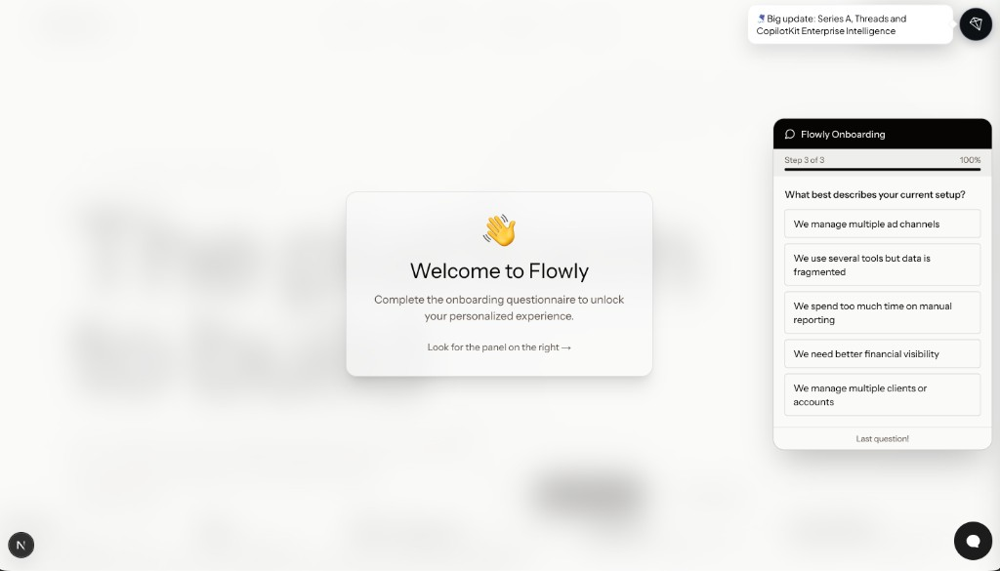
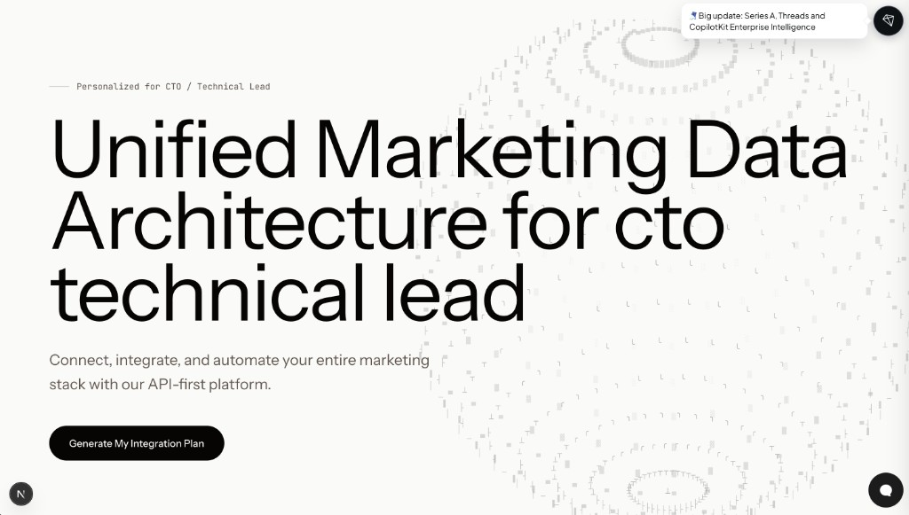
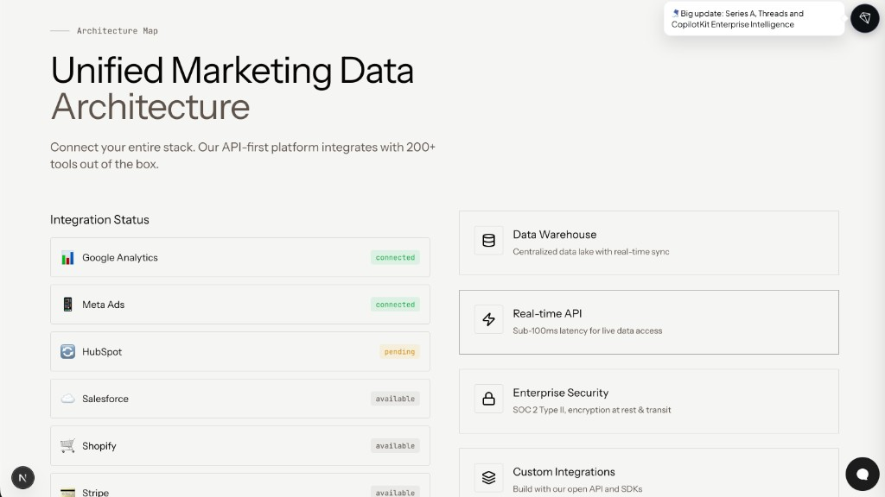

# Flowly AI Onboarding Assistant

Adaptive landing page system with AI-powered onboarding via CopilotKit chat.

## Overview

Users complete an onboarding questionnaire via CopilotKit chat, and the landing page dynamically personalizes based on their role, goals, and setup.

## Preview

### Onboarding (CopilotKit panel)



### Personalized landing



### Architecture map



## Tech Stack

- **Next.js 16** with App Router
- **CopilotKit** - AI chat integration with sidebar
- **Google Gemini** - AI model (gemini-1.5-flash-8k)
- **TypeScript** - Type safety
- **Tailwind CSS** - Styling

## Project Structure

```
├── app/
│   ├── api/copilotkit/route.ts     # CopilotKit API endpoint
│   ├── client-layout.tsx           # Client components (CopilotKit providers)
│   ├── layout.tsx                  # Server layout with metadata
│   └── page.tsx                    # Main page with adaptive landing
├── components/
│   ├── chat/
│   │   └── OnboardingPanel.tsx     # Onboarding form (right side panel)
│   └── landing/                    # 16 landing components from optimus
├── hooks/
│   ├── useOnboardingChat.ts         # Onboarding state management
│   └── useUserProfile.ts           # User profile context (role, goal, setup)
└── lib/
    ├── dynamic-variables.ts        # {{variable}} interpolation system
    └── persona-mapping.ts          # UserProfile types & persona mapping
```

## Key Features

1. **Onboarding Flow**: 3-question questionnaire (role → goal → setup)
2. **Dynamic Landing**: Persona-specific content based on user answers
3. **Copilot Sidebar**: Opens by default, guides user through questions
4. **Onboarding Panel**: Floating panel on right side for form input
5. **Agent Guidance**: AI agent prompts user through each question

## Configuration

Set your Google API key in `.env`:

```
GOOGLE_API_KEY=your_api_key_here
```

## Running

```bash
npm run dev
```

Open http://localhost:3000 - landing shows blurred until onboarding complete.

## Recent Changes

- Moved OnboardingPanel from right of sidebar to full right side of screen
- Removed OnboardingA2UI component (useCopilotAction render prop caused build errors)
- Simplified client-layout.tsx to use OnboardingPanel instead
- Switched from gemini-2.5-flash to gemini-1.5-flash-8k for quota management

## Known Issues

- CopilotKit `useCopilotAction` with `render` prop causes "Invalid action configuration" - using panel UI instead
- Gemini free tier has 20 requests/month limit
